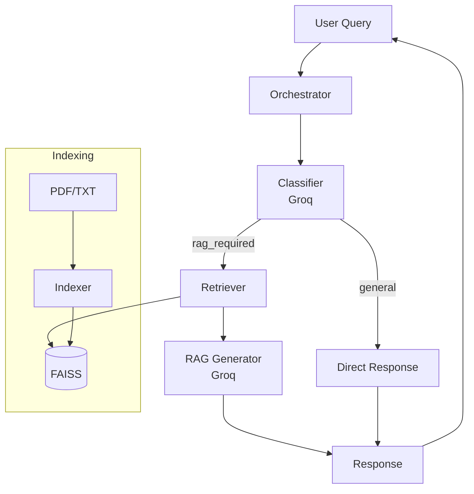

# Design Document: Agentic RAG System (MVP)

## Overview

This document describes the technical design for a Minimum Viable Product (MVP) of a multi-agent AI system for document analysis using RAG. The MVP focuses on core functionality with a simplified agent structure.

**MVP Scope:**
- Support for TXT and PDF documents only (HTML deferred)
- Single LLM provider initially (Groq for speed)
- Basic verification without retry loops
- Essential traceability logging

The architecture leverages:
- **Groq (Llama 3.1 8B)**: Primary LLM for classification, RAG, and verification
- **FAISS**: Vector store for similarity search
- **Sentence Transformers**: Local embeddings (no API dependency)

## Architecture



**MVP Simplifications:**
- Unified intent classification: `general` vs `rag_required` (combines factual/summary/comparison)
- Verification deferred to v2 (basic response validation only)
- Single LLM provider reduces complexity

## Components and Interfaces

### 1. Indexer

**Purpose**: Load, chunk, and index documents into FAISS.

```typescript
interface Indexer {
  loadDocument(path: string): Promise<Document>;
  chunkDocument(doc: Document): Chunk[];
  indexChunks(chunks: Chunk[]): Promise<void>;
}

interface Document {
  id: string;
  content: string;
  filename: string;
  sourceType: 'pdf' | 'txt';
}

interface Chunk {
  id: string;
  documentId: string;
  content: string;
  tokenCount: number;
}
```

### 2. Classifier

**Purpose**: Determine if query needs RAG or direct response.

```typescript
interface Classifier {
  classify(query: string): Promise<ClassificationResult>;
}

interface ClassificationResult {
  intent: 'general' | 'rag_required';
  normalizedQuery: string;
}
```

### 3. Retriever

**Purpose**: Search FAISS for relevant chunks.

```typescript
interface Retriever {
  search(query: string, topK?: number): Promise<SearchResult[]>;
}

interface SearchResult {
  chunk: Chunk;
  score: number;
}
```

### 4. RAGGenerator

**Purpose**: Generate responses using retrieved context.

```typescript
interface RAGGenerator {
  generate(query: string, context: SearchResult[]): Promise<RAGResponse>;
}

interface RAGResponse {
  answer: string;
  sources: string[];
}
```

### 5. Orchestrator

**Purpose**: Coordinate the pipeline flow.

```typescript
interface Orchestrator {
  process(query: string): Promise<Response>;
}

interface Response {
  answer: string;
  sources?: string[];
  traceId: string;
}

interface TraceEntry {
  traceId: string;
  timestamp: string;
  step: string;
  duration: number;
}
```

## Data Models

### Chunk Model (with JSON serialization)

```typescript
interface Chunk {
  id: string;
  documentId: string;
  content: string;
  tokenCount: number;
}

// Serialization functions
function serializeChunk(chunk: Chunk): string {
  return JSON.stringify(chunk);
}

function deserializeChunk(json: string): Chunk {
  return JSON.parse(json);
}
```

### Trace Model (with JSON serialization)

```typescript
interface Trace {
  id: string;
  entries: TraceEntry[];
  startTime: string;
  endTime?: string;
}

// Serialization functions
function serializeTrace(trace: Trace): string {
  return JSON.stringify(trace);
}

function deserializeTrace(json: string): Trace {
  return JSON.parse(json);
}
```

### Configuration Model

```typescript
interface Config {
  groq: {
    apiKey: string;
    model: string;  // default: 'llama-3.1-8b-instant'
  };
  faiss: {
    indexPath: string;
    dimension: number;  // default: 384 for all-MiniLM-L6-v2
  };
  chunking: {
    minTokens: number;  // default: 200
    maxTokens: number;  // default: 500
    overlap: number;    // default: 50
  };
  retrieval: {
    topK: number;       // default: 5
  };
}
```


## Correctness Properties

*A property is a characteristic or behavior that should hold true across all valid executions of a system-essentially, a formal statement about what the system should do. Properties serve as the bridge between human-readable specifications and machine-verifiable correctness guarantees.*

### Property 1: Chunk Serialization Round-Trip

*For any* valid Chunk object, serializing to JSON and then deserializing back SHALL produce an equivalent Chunk with identical id, documentId, content, and tokenCount.

**Validates: Requirements 1.8, 1.9**

### Property 2: Trace Serialization Round-Trip

*For any* valid Trace object, serializing to JSON and then deserializing back SHALL produce an equivalent Trace with identical id, entries, and timestamps.

**Validates: Requirements 7.5, 7.6**

### Property 3: Chunk Token Count Invariant

*For any* document processed by the Indexer, all generated chunks SHALL have a token count between 200 and 500 tokens inclusive.

**Validates: Requirements 1.5**

### Property 4: Text Normalization Idempotence

*For any* text string, applying normalization twice SHALL produce the same result as applying it once.

**Validates: Requirements 1.4**

### Property 5: Retrieval Results Ordering

*For any* retrieval operation returning multiple results, the results SHALL be ordered by similarity score in descending order.

**Validates: Requirements 3.3**

### Property 6: Classification Result Validity

*For any* user query, the Classifier SHALL return a valid intent ('general' or 'rag_required') and a non-empty normalized query string.

**Validates: Requirements 2.1, 2.6**

### Property 7: RAG Response Contains Sources

*For any* RAG response generated with non-empty context, the response SHALL include at least one source reference from the provided chunks.

**Validates: Requirements 4.3**

### Property 8: Routing Correctness

*For any* query classified as "general", the pipeline SHALL skip retrieval. *For any* query classified as "rag_required", the pipeline SHALL execute retrieval and RAG generation.

**Validates: Requirements 6.2, 6.3**

## Error Handling

### MVP Error Strategy

| Component | Error Type | Handling |
|-----------|------------|----------|
| Indexer | File not found | Skip file, log warning |
| Indexer | PDF parse error | Skip file, log error |
| Classifier | LLM timeout | Default to 'rag_required' |
| Retriever | Empty results | Return empty array |
| RAG | LLM error | Return error message to user |
| Orchestrator | Any failure | Log trace, return user-friendly error |

## Testing Strategy

### Property-Based Testing Library

The system will use **fast-check** for property-based testing in TypeScript.

Each property test will:
- Run minimum 100 iterations
- Be tagged: `**Feature: agentic-rag-system, Property {number}: {property_text}**`

**Generators:**

```typescript
import * as fc from 'fast-check';

// Chunk generator
const chunkArb = fc.record({
  id: fc.uuid(),
  documentId: fc.uuid(),
  content: fc.string({ minLength: 100, maxLength: 2500 }),
  tokenCount: fc.integer({ min: 200, max: 500 })
});

// Trace generator
const traceArb = fc.record({
  id: fc.uuid(),
  entries: fc.array(fc.record({
    traceId: fc.uuid(),
    timestamp: fc.date().map(d => d.toISOString()),
    step: fc.string(),
    duration: fc.nat({ max: 30000 })
  })),
  startTime: fc.date().map(d => d.toISOString())
});

// Intent generator
const intentArb = fc.constantFrom('general', 'rag_required');
```

### Test Organization

```
tests/
├── indexer.test.ts
├── classifier.test.ts
├── retriever.test.ts
├── rag.test.ts
├── orchestrator.test.ts
└── properties/
    ├── serialization.property.test.ts
    ├── chunking.property.test.ts
    └── routing.property.test.ts
```
